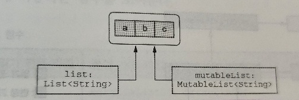

# 6장 코틀린 타입 시스템 

## 6.2 코틀린의 원시 타입

> 코틀린은 원시 타입과 래퍼 타입을 구분하지 않는다.


### 6.2.1 원시타입 : Int, Boolean 등

- 코틀린은 원시 타입과 래퍼타입을 구분하지 않으므로 항상 같은 타입을 사용한다
- 코틀린에서는 숫자 타입 등 원시타입의 값에 대해 메서드를 호출할 수 있다
- 실행 시점에 숫자 타입은 가장 효율적인 방식으로 표현 된다

### 6.2.2 널이 될 수 있는 원시 타입: Int?, Boolean? 등

```kotlin
data class Person(val name: String, val age: Int? = null) {
    fun isOlderThan(other: Person) : Boolean? {
        if (age == null || other.age == null)
            return null
        return age > other.age
    }
}
```

- 코틀린에서 널이 될 수 있는 원시 타입을 사용하면 그 타입은 자바의 래퍼타입으로 컴파일 된다
  - 널이 될 가능성이 있으므로 값을 직접 비교할 수 없다
  - 널체크 이후 검사를 해야 한다
- 제네릭 클래스의 경우 래퍼 타입을 사용한다
- 어떤 클래스의 타입 인자로 원시 타입을 넘기면 코틀린은 그 타입에 대한 박스 타입을 사용 한다
  - JVM 은 타입 인자로 원시타입을 허용하지 않기 때문에 제네릭 클래스는 항상 박스 타입을 사용해야 한다

### 6.2.3 숫자 변환

- 코틀린은 한타입의 숫자를 다른 타입의 숫자로 자동 변환하지 않는다
- 결과 타입이 허용되는 숫자의 범위가 원래 타입의 범위보다 넓은 경우 조차도 자동 변환은 불가능하다

```kotlin
val i = 1
val l: Long = i // Error: type mismatch 컴파일 오류 발생
```

- 대신 직접 변환 메서드를 호출해야 한다

```kotlin
val i = 1
val l: Long = i.toLong()
```

- 코틀린은 개발자의 혼란을 피하기 위해 타입 변환을 명시하기로 결정했다

```kotlin
val x = 1
val list = listOf(1L, 2L, 3L)

x in list // 묵시적 타입 변환으로 인해 false ( int 와 Long 비교)

x.toLong() in list // true  (Long 과 Long 비교)

```

- 숫자 리터럴을 사용할 때는 보통 변환 함수를 호출할 필요가 없다
  - 42L 이나 42.0f 처럼 상수 뒤에 타입을 표현하는 문자를 붙이면 변환이 필요 없다
- 산술 연산자는 적당한 타입 값을 받아들일 수 있게 이미 오버로드돼 있다

```kotlin
fun foo(l: Long) = println(l)

val b: Byte = 1
val l = b + 1L // + 는 byte 와 long 을 인자로 사용할 수 있다
foo(42) // int 42 를 Long 으로 해석

// >> 42
```

### 6.2.4 Any, Any?: 최상위 타입

- 자바에서 Object 가 클래스 계층의 최상위 타입이듯 코틀린에서는 Any 타입이 모든 널이 될 수 없는 타입의 조상 타입이다
- 자바는 참조 타입만 Object 를 정점으로 하는 타입 계층에 포함되며, 원시타입은 그런 계층에 들어있지 않다
- 코틀린에서는 Any 가 Int 등의 원시 타입을 포함한 모든 타입의 조상 타입이다
- 원시 타입 값을 Any 타입의 변수에 대입하면 자동으로 값을 객체로 감싼다

```kotlin
val answer: Any = 42 // Any 가 참조 타입이기 때문에 42가 박싱된다
```

- Any 는 널이 될 수 없다
  - 모든 값을 대입할 변수를 선언하려면 Any? 를 사용해야 한다
- 내부에서 Any 타입은 java.lang.Object 에 대응한다
- 모든 코틀린 클래스에는 toString, equals, hashCode 라는 세 메서드가 들어있다
  - 이 세 메서드는 Any 에 정의된 메서드를 상속한 것이다
- java.lang.Object 에 들어있는 다른 메서드 (wait, notify 등)는 Any 에서 사용할 수 없다
  - 그런 메서드를 호출하고 싶다면 java.lang.Object 타입으로 캐스팅해야 한다

### 6.2.5 Unit 타입: 코틀린의 void

> 코틀린 Unit 타입은 자바 void 와 같은 기능을 한다

```kotlin
fun f(): Unit {...}
fun f() {...} // Unit 생략 가능
```

- 코틀린 함수의 반환 타입이 Unit 이고 함수가 제네릭 함수를 오버라이드 하지 않는다면 그 함수는 내부에서 자바 void 함수로 컴파일 된다
- Unit 과 void 의 다른 점은 무엇일까?
  - Unit 은 모든 기능을 갖는 일반적인 타입이며, void 와 달리 Unit 을 타입 인자로 쓸 수 있다
  - Unit 타입에 속한 값은 Unit 이란 이름의 단 하나의 값이다
  - Unit 타입의 함수는 Unit 값을 묵시적으로 반환한다
- 이 특성은 제네릭 파라미터를 반환하는 함수를 오버라이드 하면서 반환 타입으로 Unit 을 쓸 때 유용하다

```kotlin
interface  Processor<T> {
    fun process(): T
}

class NoResultProcessor : Processor<Unit> {
    override fun process() {  // Unit 을 반환 하지만 타입을 지정할 필요는 없다
        // 업무 처리 코드  
        
        // return 을 명시할 필요가 없다
    }
}

```

- 함수형 프로그래밍에서 전통적으로 Unit 은 단 하나의 인스턴스만 갖는 타입을 의미해 왔고, 바로 그 유일한 인스턴스의 유무가 자바 void 와 코틀린 Unit 을 구분하는 가장 큰 차이다 (?)

### 6.2.6 Nothing 타입: 이 함수는 결코 정상적으로 끝나지 않는다

> 반환 값이라는 개념 자체가 의미 없는 함수가 일부 존재한다

- Nothing 타입은 아무 값도 반환하지 않는다
- Nothing 은 함수의 반환 타입이나 반환 타입으로 쓰일 타입 파라미터로만 쓸 수 있다
- Nothing 을 반환하는 함수를 앨비스 연산자의 유형에 사용해서 전제 조건을 검사할 수 있다
- 
```kotlin
val address = company.address ?: fail("No address")

println(address.city) // address 의 값이 null 이면 예외가 발생한다는 사실을 알고 있으므로, 값이 널이 아닌 것을 추론할 수 있다
```

---

## 6.3 컬렉션과 배열

### 6.3.1 널 가능성과 컬렉션

- 컬렉션 안에 널 값을 넣을 수 있는지 여부는 어떤 변수의 값이 널이 될 수 있는지 여부와 마찬가지로 중요하다

```kotlin

import java.io.BufferedReader

fun readNumbers(reader: BufferedReader) : List<Int?> {
    val result = ArrayList<Int?>() // 널이 될 수 있는 int 값으로 이루어진 배열
    
    for (line in reader.lineSequence()) {
        try {
            val number = line.toInt();
            result.add(numbver)
        } catch (e: NumberFormatException) {
            result.add(null)
        }
    }
    
    return result
}
```

- List<Int?>
  - 원소의 값이 null 이 들어올 수 있다
- List<Int>?
  - 리스트가 null 일 수 있다
- List<Int?>?
  - 리스트가 null 일 수 있고, 원소의 값이 null 이 들어올 수 있다


- 널이 될 수 있는 값으로 이뤄진 컬렉션으로 널 값을 걸러내는 경우에는 filterNotNull 함수를 사용할 수 있다

```kotlin
fun addValidNumbers(numbers: List<Int?>) {
    val validNumbers = numbers.filterNotNull() // filterNotNull 이 컬렉션 안에 널이 들어있지 않음을 보장해주므로 타입은 List<Int> 타입이다
}
```

### 6.3.2 읽기 전용과 변경 가능한 컬렉션

- 코틀린에서는 컬렉션안의 데이터에 접근하는 인터페이스와 데이터를 변경하는 인터페이스를 분리가 되어있다
- Collection -> 데이터 접근용
- MutableCollection -> 데이터 변경용
- 코드에서 가능하면 읽기 전용 인터페이스를 사용하는 것을 규칙으로 삼는 것이 좋다
  - 변경할 필요가 있을 때만 변경 가능한 버전을 사용해라
- 읽기전용 컬렉션이라해서 꼭 변경 불가능한 컬렉션일 필요는 없다
  - 다른 곳에서 변경 가능한 인터페이스 타입의 참조로 사용할 수 도 있다



- 읽기전용 컬렉션은 스레드 세이프 하지 않다
- 다중 스레드 환경에서 데이터를 다루는 경우 데이터를 도익화 하거나, 동시 접근을 허용하는 데이터 구조를 활용해야 한다

### 6.3.3 코틀린 컬렉션과 자바

- 코틀린은 자바 호환성을 제공하는 한편 읽기 전용 인터페이스와 변경 가능 인터페이스를 분리한다

  | 컬렉션 타입  | 읽기 전용 타입 | 변경 가능 타입                                          |
  |---------|----------|---------------------------------------------------|
  | List    | listOF   | mutableListOf, arrayListOf                        |
  | Set     | setOf    | mutableSetOf, hashSetOf, linkedSetOf, sortedSetOf |
  | Map     | mapOf    | mutableMapOf, hashMapOf, linkedMapOf, sortedMapOf |

- 자바 메서드를 호출하되 컬렉션을 인자로 넘겨야 한다면 따로 변환하거나 복사 등의 추가 적업 없이 직접 컬렉션을 넘기면 된다
- 자바는 읽기전용 컬렉션과 변경 가능 컬렉션을 구분하지 않으므로 코틀린에서 읽기전용 Collection 으로 선언된 객체라도 변경될 가능성이 있다
  - 컬렉션을 자바 코드에게 넘길 때는 특별히 주의를 기울여야 한다

### 6.3.4 컬렉션을 플랫폼 타입으로 다루기

- 자바 쪽에서 선언한 컬렉션 타입의 변수를 코틀린에서는 플랫폼 타입으로 본다
  - 플랫폼 타입 컬렉션은 기본적으로 변경 가능성에 대해 알 수 없다
  - 코틀린 코드는 그 타입을 읽기 전용이나 변경 가능한 컬렉션 어느 쪽으로든 다룰 수 있다
- 컬렉션 타입이 시그니처에 들어간 자바 메서드 구현을 오버라이드 하는 경우 어던 코틀린 컬렉션 타입으로 표현할지 결정해야 한다
  - 결정 기준
    1. 컬렉션이 널이 될 수 있는가?
    2. 컬렉션의 원소가 널이 될 수 있는가?
    3. 오버라이드 하는 메서드가 컬렉션을 변경할 수 있는가?
  - 선택을 하려면 자바 인터페이스나 클래스가 어떤 맥락에서 사용되는지 정확히 알아야 한다

```java
interface FileContentProcessor {
    void processContents(File p, byte[] b, List<String> l);
}
```

```kotlin
class FileIndexer : FileContentProcessor {
    override fun processCOntents(p: File,
                                 b: ByteArray?,
                                 l: List<String>?) {
        ...
    }
}
```

### 6.3.5 객체의 배열과 원시 타입의 배열

- 코틀린 배열은 타입 파라미터를 받는 클래스이다
- 코틀린에서 배열을 만드는 방법
  - arrayOf : 원소를 넘기면 배열 생성
  - arrayOfNulls : 인자로 넘긴 숫자만큼의 크기를 가진 null 값으로 채워진 배열 생성
  - Array 생성자 : 크기와 람다를 인자를 받아서 원소를 초기화

```kotlin
val letters = Array(26) { i -> ('a' + i).toString() }
```

- toTypedArray 메서드를 사용하면 컬렉션을 배열로 바꿀 수 있다

```kotlin
val strings = listOf("a", "b", "c")

strings.toTypeArray()
```

- 배열 타입의 인자도 항상 객체 타입이 된다
- 박싱하지 않은 원시타입의 배열이 필요하다면 특별한 배열 클래스를 사용해야 한다
  - IntArray, ByteArray, CharArray, BooleanArray 등등

```kotlin
var fiveZeros = IntArray(5) // 원소들이 기본값인 0으로 초기화 되어있다
val fiveZeroToo = intArrayOf(0, 0, 0, 0, 0)
val squares = IntArray(5) { i-> (i+1) * (i+1) } // 람다를 인자로 받는 생성자
```

- forEachIndexed 는 배열의 모든 원소를 갖고 인자를 받은 다음 람다를 호출해 준다
  - 이때 배열의 원소와 그 원소의 인덱스를 람다에게 인자로 전달한다

```kotlin
fun main(args: Array<String>) {
    args.forEachIndexed {index, element -> 
        printlng ("$index $element")
    }
}
```