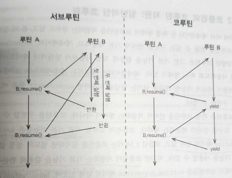

# 부록 E. 코루틴과 Async/Await

## E.1 코루틴이란?

- 코루틴은 컴퓨터 프로그램 구성 요소 중 하나로 비선점형 멀티태스킹을 수행하는 일반화한 서브루틴이다.
- 실행을 일시중단 하고 재개 할 수 있는 여러 진입 지점을 허용한다

----

#### 서브루틴

- 여러 명령어를 모아 이름을 부여해서 반복 호출할 수 있게 정의한 프로그램 구성 요소
- 다른 말로 함수 라고 한다
- 메서드도 서브루틴이라 할 수 있다
- 서브루틴에 진입하면(함수 호출) 활성 레코드가 스택에 할당되면서 서브루틴 내부의 로컬 변수 등이 초기화 된다
- 서브루틴 안에서 여러번 return 을 사용할 수 있다
  - 서브루틴이 실행을 중단하고 제어를 호출한쪽에게 돌려주는 지점은 여럿 있을 수 있다
  - 서브루틴에서 반환되고 나면 활성 레코드가 스택에서 사라진다
    - 실행 중이던 모든 상태를 잃어버리게 된다
- 서브 루틴을 여러 번 반복 실행해도 항상 같은 결과를 얻게 된다

#### 멀티태스킹

- 여러 작업을 동시에 수행하는 것처럼 보이거나, 실제로 동시에 수행하는 것

#### 비선점형

- 멀티태스킹의 각 작업을 수행하는 참여자들의 실행을 운영체제가 강제로 일시 중단시키고 다른 참여자를 실행하게 만들 수 없다는 뜻
- 각 참여자들이 서로 자발적으로 협력해야만 비선점형 멀티태스킹이 제대로 작동할 수 있다

#### 코루틴

- 서로 협력해서 실행을 주고 받으면서 작동하는 여러 서브루틴



- 서브루틴은 처음부터 실행을 다시 시작한다
- 코루틴은 yield 로 실행을 양보했던 지점부터 실행을 계속한다
- 장점
  - 일반적인 프로그램 로직을 기술하듯 코드를 작성하고 상대편 코루틴에 데이터를 넘겨야 하는 부분에서만 yield 를 사용하면 된다는 점

```kotlin
// 제너레이터를 사용해 카운트다운을 구현하고, 이를 이터레이터 처럼 불러와 사용하는 의사코드를

generator countdown(n) {
    while(n > 0) {
        yield n 
        n -= 1
    }
}

for i in coutdown(10) {
    println(i)
}

```

---

## E.2 코틀린의 코루틴 지원: 일반적인 코루틴

- 제너레이터만 제공하는 경우에도 yield 시 퓨처등 비동기 처리가 가능한 객체를 넘기는 방법을 사용하면 async/await 등을 비교적 쉽게 구현할 수 있다
- 코틀린은 특정 코루틴을 언어가 지원하는 형태가 아니라, 코루틴을 구현할 수 있는 기본 도구를 언어가 제공한다
- 코틀린이 지원하는 기본 기능을 활용해 만든 코루틴들은 kotlinx.coroutines 패키지 밑에 있다

---

### E.2.1 여러 가지 코루틴

- kotlinx.coroutines.core 모듈
  - 코루틴을 만들어주는 코루틴 빌더
  - 코루틴 빌더에 원하는 동작을 람다로 넘겨서 코루틴을 만들어 싱행하는 방식으로 코루틴을 활용한다

#### kotlinx.coroutines.CoroutineScope.launch

- launch 는 코루틴을 job 으로 반환한다
- 만들어진 코루틴은 기본적으로 즉시 실행된다
- 원하면 launch가 반환한 job 의 cancel() 을 호출해 코루틴 실행을 중단시킬 수 있다
- launch 가 작동하려면 CoroutineScope 객체가 블록의 this 로 지정돼야 한다 
- 다른 suspend 함수 내부라면 해당 함수가 사용 중인 CoroutineScope 가 있겠지만, 그렇지 않은 경우에는 GlobalScope 를 사용하면 된다

```kotlin
fun launchInGlobalScope() {
    GlobalScope.launch {
        log("코루틴 시작")
    }
}

fun main() {
    log("메인 시작")
    launchInGlobalScope()
    log("launchInGlobalScope 실행")
    Thread.sleep(5000L)
    log("메인 종료")
}
```

```text
# 출력 결과

main, 5 > 메인 시작
main, 5 > launchInGlobalScope 실행
DefaultDispatcher-worker-xx> 코루틴 시작
main, 5 > 메인 종료
```

- 메인 함수와 GlobalScope.launch 가 만들어낸 코루틴이 서로 다른 스페이드에서 실행된다
- GlobalScope 는 메인 스레드가 실행 중인 동안에만 코루틴의 동작을 보장해준다
  - Thread.sleep 을 없애면 코루틴이 실행되지 않을 것이다
- launchInGlobalScope 가 호출한 launch 는 스레드가 생성되고 시작되기 전에 메인 스레드의 제어를 main() 에 돌려주기 때문에 sleep 을 하지 않으면 main() 이 바로 끝나고 메인 스레드가 종료되면서 바로 프로그램 전체가 끝나버린다
- GlobalScope 를 사용할 때는 main 스레드 종료 시점에 대해 조심해야 한다
- 이를 방지하기 위해서는
  - 비동기적으로 launch 를 실행하거나
  - launch 가 모두 실행될 때까지 기다려야 한다
- 코루틴의 실행이 끝날 때까지 현재 스레드를 블록시키는 함수는 runBlocking() 이 있다
- runBlocking 은 CoroutineScope 의 확장 함수가 아닌 일반 함수이기 때문에 별도의 코루틴 스코프 객체 없이 사용 가능하다

```kotlin
// launchInGlobalScope -> runBlockingExample

fun runBlockingExample() {
    runBlocking {
        launch {
            log("코루틴 시작")
        }
    }
}

fun main() {
  log("메인 시작")
  launchInGlobalScope()
  log("runBlockingExample 실행")
  Thread.sleep(5000L)
  log("메인 종료")
}
```

```text
# 출력 결과

main, 5 > 메인 시작
main, 5 > 코루틴 시작
main, 5 > runBlockingExample 실행
main, 5 > 메인 종료
```

- 스레드가 모두 main 스레드이다

---

#### 코루틴들은 서로 yield() 를 해주면서 협력할 수 있다

```kotlin
fun yieldExample() {
    runBlocking {
        launch {
            log("1")
            yield()
            log("3")
            yield()
            log("5")
        }
      
        log("after first launch")
      
        launch {
            log("2")
            delay(1000L)
            log("4")
            delay(1000L)
            log("6")
        }
      
        log("after second launch")
    }
}

fun main() {
  log("메인 시작")
  yieldExample()
  log("yieldExample 실행")
  Thread.sleep(5000L)
  log("메인 종료")
}
```

```text
main > 메인 시작
main > after first launch
main > after second launch
main > 1
main > 2
main > 3
main > 5
main > 4
main > 6
main > after runBlocking
main > yieldExample 실행
main > 메인 종료
```

- launch 는 즉시 반환된다
- runBlocking 은 내부 코루틴이 모두 끝난 다음에 반환된다
- delay() 를 사용한 코루틴은 그 시간이 지날 때까지 다른 코루틴에게 실행을 양보한다
  - 위 예시에서 delay 대신 yield 를 사용하면 1,2,3,4,5,6 이 출력될 것이다
- 첫 번재 코루틴이 두 번이나 yield 를 했지만, 두 번째 코루틴이 delay 상태에 있었기 때문에 다시 제어가 첫 번째 코루틴에게 돌아왔다

---

#### Kotlinx.coroutines.CoroutineScope.async

- async 는 사실상 launch 와 같은 일을 한다.
- 차이점은 launch 가 job 을 반환하는 반면, async 는 deffered 를 반환한다
- deffered 는 job 을 상속한 클래스이기 때문에 launch 대신 async 를 사용해도 항상 아무 문제가 없다

#### Deffered VS Job 

- Job 은 아무 타입 파라미터가 없고, Deffered 는 타입 파라미터가 있는 제네릭 타입이다
- Deffered 안에는 await() 함수가 정의돼 있다
- Deffered 의 타입 파라미터는 바로 Deffered 코루틴이 계ㅒ산을 하고 돌려주는 값의 타입이다
- Job 은 Unit 을 돌려주는 Deffered<Unit> 이라고 생각할 수도 있을 것이다
- async 는 코드 블록을 비동기로 실행할 수 있다
- async 가 반환하는 Deffered 의 await 을 사용해서 코루틴이 결과 값을 내놓을 때까지 기다렸다가 결과 값을 얻어낼 수 있다

```kotlin
// 1부터 3까지 수를 더하는 과정을 async/await 을 사용해 처리하는 모습

fun sumAll() {
    runBlocking {
        val d1 = async { delay(1000L); 1 }
        log("after async d1")
      
        val d2 = async { delay(2000L); 2 }
        log("after async d2")
      
        val d3 = async { delay(3000L); 3 }
        log("after async d3")
      
        log("1+2+3 = ${d1.await() + d2.await() + d3.await()}")
        log("after await all & add")
    }
}
```

```text
00:00:00 main > after async d1
00:00:00 main > after async d2
00:00:00 main > after async d3
00:00:03 main > 1+2+3 = 6
00:00:03 main > after await all & add
```

- d1, d2, d3 를 하나하나 순서대로 실행하면 총 6초 이상이 걸려야 한다
  - 하지만 총 3초가 걸렸다
- async 로 코드를 실행하는 데는 시간이 거의 걸리지 않는다
- 스레드를 여럿 사용하는 병렬 처리와 달리 모든 async 함수들이 메인 스레드 안에서 실행 된다
  - 이 부분이 async/await 과 스레드를 사용한 병렬 처리의 큰 차이점이다
- 비동기 코드가 늘어남에 따라 async/await 을 사용한 비동기가 빛을 발한다

---

### E.2.2 코루틴 컨텍스트와 디스패치

- launch, async 등은 모두 CoroutineScope 의 확장 함수다
- CoroutineScope 에는 CoroutineContext 타입의 필드 하나만 들어있다
- 사실 CoroutineScope 는 CoroutineContext 필드를 launch 등의 확장 함수 내부에서 사용하기 위한 매개체 역할만을 담당한다
- CoroutineContext 는 실제로 코루틴이 실행 중인 여러 작업(job) 과 디스패처를 저장하는 일종의 맵이라 할 수 있다
- 코틀린 런타임은 이 CoroutineContext 를 사용해서 다음에 실행할 작업을 선정하고, 어떻게 스레드에 배정할지 결정한다

```kotlin
launch { // 부모 컨텍스트를 사용 (이 경우 main)
}

launch(Dispatchers.Unconfined) { // 특정 스레드에 종속되지 않음, 메인 스레드 사용
}

launch(Dispatchers.Default) { // 기본 디스패처를 사용
}

launch(newSingleThreadContext("MYOwnThread")) { // 새 스레드를 사용
}
```

- 같은 launch 를 사용하더라도, 전달하는 컨텍스트에 따라 서로 다른 스레드상에서 코루틴이 실행된다

---

### E.2.3 코루틴 빌더와 일시 중단 함수

- launch, async, runBlocking 은 모두 코루틴 빌더라고 불린다
- 추가로 두 가지가 더 있다
  - produce : 정해진 채널로 데이터를 스트림으로 보내는 코루틴을 만든다
  - actor : 정해진 채널로 메시지를 받아 처리하는 액터를 코루틴으로 만든다

---

- delay() 와 yield() 는 코루틴 안에서 특별한 의미를 지니는 함수들이다
  - 이런 함수들을 일시 중단 함수 라고 부른다
  - 일시 중단 함수
    - delay
    - yield
    - withContext : 다른 컨텍스트로 코루틴을 전환
    - withTimeout : 코루틴이 정해진 시간 안에 실행되지 않으면 예외를 발생시킨다
    - withTimeoutOrNull : 코루틴이 정해진 시간 안에 실행되지 않으면 null 을 결과로 돌려준다
    - awaitAll : 모든 작업의 성공을 기다린다. 작업 중 어느 하나가 예외로 실패하면 awaitAll 도 그 예외로 실패한다
    - joinAll : 모든 작업이 끝날 떄까지 현재 작업을 일시 중지한다

---

## E.3 suspend 키워드와 코틀린의 일시 중단 함수 컴파일 방법

- 일반 함수 속에서 delay() 나 yield() 를 사용하면?
  - 오류가 표시 된다
- 일시 중단 함수를 코루틴이나 일시 중단 함수가 아닌 함수에서 호출하는 것은 컴파일 수준에서 금지된다

#### 일시 중단 함수 만드는 방법

- suspend 키워드 사용

```kotlin
suspend fun yieldThreeTimes() {
    log("1")
    delay(1000L)
    yield()
    log("2")
    delay(1000L)
    yield()
    log("3")
    delay(1000L)
    yield()
    log("4")
}

fun suspendExample() {
    GlobalScope.launch { yieldThreeTimes() }
}
```

- suspend 함수 작동 원리
  - 일시 중단 함수 안에서 yield() 를 하는 경우
    - 코루틴에 진입할 때와 나갈 때 코루틴이 실행 중이던 상태를 저장하고 복구하는 등의 작업을 할 수 있어야 한다
    - 현재 실행 중이던 위치를 저장하고 닷 ㅣ코루틴이 재개될 때 해당 위치부터 실행을 재개할 수 있어야 한다
    - 다음에 어떤 코루틴을 실행할지 결정한다
      - 코루틴 컨텍스트에 있는 디스패처에 의해 수행된다

#### CPS 변환

- 프로그램의 실행 중 특정 시점 이후에 진행해야 하는 내용을 별도의 함수로 뽑고, 그 함수에게 현재 시점까지 실행한 결과를 남겨서 처리하게 만드는 소스코드 변환 기술
- CPS 를 사용하는 경우 프로그램이 다음에 해야 할 일이 항상 컨티뉴에이션 이라는 함수 형태로 전달된다
  - 그렇기에 나중에 할 일을 명확히 알 수 있다
  - 컨티뉴에이션에 넘겨야 할 값이 무엇인지도 명확하게 알 수 있다
  - 실행중이던 특정 시점의 맥락을 잘 저장했다가 필요할 때 다시 재개할 수 있다
- 콜백 스타일 프로그래밍과도 유사하다

```kotlin
suspend fun example(v: Int) : Int {
    return v*2
}

// 코틀린 컴파일러로 컴파일하면서 Continuation 을 인자로 만들어 붙여준다
public static final Object example(int v, @NotNull Continuation var1)
```

- 함수를 호출할 때는 함수 호출이 끝난 후 수행해야 할 작업을 var1 에 Contibutaion 으로 전달한다
- 함수 내부에서는 필요한 모든 일을 수행한 다음에 결과를 var1 에 넘기는 코드를 추가한다
  - 예제에서는 v*2 를 인자로 Continuation 을 호출하는 코드가 들어간다
- CPS 를 사용하면 코루틴을 만들기 위해 필수적인 일시 중단 함수를 만드는 문제가 쉽게 해결 된다
- 모든 코드를 CPS 로만 변환하면 지나치게 많은 중간 함수들이 생길 수 있다
  - 코루틴이 제어를 다른 함수에 넘겨야 하는 시점에서만 컨티뉴에이션이 생기도록 만들 수 있다

---

## E.4 코루틴 빌더 만들기

- 일반적으로 직접 코루틴 빌더를 만들 필요는 없다
  - async, launch 등만으로도 상당히 다양한 작업을 처리할 수 있기 때문

### E.4.1 제너레이터 빌더 사용법

```kotlin
fun idMaker() = generate<Int, Unit> {
    var index = 0
    while (index < 3) 
        yield(index++)
}

fun main(args: Arrays<String>) {
    val gen = inMaker()
    println(gen.next(Unit)) // 0
    println(gen.next(Unit)) // 1
    println(gen.next(Unit)) // 2 
    println(gen.next(Unit)) // null (제너레이터가 끝나서 null 반환)
}
```

### E.4.2 제너레이터 빌더 구현

- 가장 쉬운 타입은 generator 함수가 만들어 반환해야 하는 Generator<R, T> 타입이다
  - next(T) 를 호출해 R 타입의 값을 돌려받아 처리할 수 있게 해준다

```kotlin
interface Generator<out R, in T> {
  fun next(param: T): R ? // 제너레이터가 끝나면 null 을 돌려주므로 ? 가 붙는다
}
```

- generator가 받는 블록 안에서는 yield() 메서드를 쓸 수 있어야 한다
- 타입은 R 을 받아서 Unit 을 돌려주는 함수여야 한다
- yield() 가 들어있는 어떤 클래스를 this 로 갖고 있어야 블록 안에서 yield() 를 호출 할 수 있다
- 그런 클래스 이름을 GeneratorBuilder 라고 붙이자 .. !
- GeneratorBuilder 는 yield 를 제공하는 클래스여야 한다

```kotlin
@RestrictsSuspension
interface GeneratorBuilder<in T, R> {
    suspend fun yield(value: T) : R
    suspend fun yieldAll(generator: Generator<T, R>, param: R)
}
```

- @RestrictsSuspension 어노테이션은 suspend 가 붙은 함수에만 이 클래스를 수신 객체로 지정할 수 있게 한다
- generate 의 타입
  - `fun <T, R> generate(block: suspend GeneratorBuilder<T, R>.(R) -> Unit): Generator<T, R>`
  - 이 함수 안에서는 코루틴을 만들고
  - 코루틴이 맨 처음 호출됐을 때 실행할 코드와 다음 단계를 진행할 때 실행할 코드를 지정하고
  - 만든 코루틴을 반환해야 한다

```kotlin
fun <T, R> generate(block: suspend GeneratorBuilder<T, R>.(R) -> Unit): Generator<T, R> {
    val coroutine = GeneratorCoroutine<T, R>()
    val initial: suspend (R) -> Unit = { result -> block(coroutine, result) }
    coroutine.nextStep = { param -> initial.startCoroutine(param, coroutine) }
    return coroutine
}
```

- val coroutine 정의 부분은 새 GeneratorCoroutine 객체를 만든다
  - 이 객체는 반환될 것이므로 타입은 Generator 여야 한다
- val initial 부분은 인자로 받은 block 을 갖고 새로운 suspend 함수를 만든다
- coroutine.nextStep 정의 부분은 코루틴이 실행되면 처리할 부분을 정의 한다

#### GeneratorBuilder 와 Generator 의 구현을 제공

- GeneratorBuilder 는 실제로 다른 객체를 만들어내지는 않는다
  - yield 를 구현해야 하느넫, yield 를 구현하려면 아래와 같은 작업이 필요하다
    1. Generator 상태 갱신
       - 다음번 next 가 호출되면 처리해야 할 일을 저장
       - yield 로 돌려줘야 하는 값을 next 에 넘길 수 있도록 준비
    2. 다음에 처리할 일을 저장하려면 Continuation 이 필요
      - suspendCoroutineUninterceptedOrReturn 을 사용하면 현재 Continuation 을 런타임으로 부터 공급받을 수 있다
      - Generator 는 다음에 처리할 일을 모두 처리한 다음에 이 Continuation 을 반드시 호출해줘야 여러 코루틴이 서로 끊어지지 않고 연결돼 실행될 수 있다
    3. yield 는 자신이 받은 인자를 제너레이터의 next 가 반환 할 수 있도록 적절히 상태를 저장해둬야 한다
       - lastValue 라는 필드에 이 값을 저장한다

```kotlin
internal class GeneratorCoroutine<T, R>: Generator<T, R>, GeneratorBuilder<T, R> {
    lateinit var nextStep: (R) -> Unit
    private var lastValue: T? = null
    private var lastException: Throwable? = null
  
    // Generator<T, R> 구현
    override fun next(param: R): T? {
        nextStep(param)
        lastException?.let { throw it }
        return lastValue 
    }
  
    // GeneratorBuilder<T, R> 구현
    override suspend fun yield(value: T): R = suspendCoroutineUnintercepteredOrReturn {
        cont -> 
            lastValue = value
            nextStep = { param -> cont.resume(param) }
            COROUTINE_SUSPENDED
    }
  
    override suspend fun yieldAll(generator: Generator<T, R>, param: R): Unit = 
            suspendCoroutineUninterceptdOrReturn sc@ {
                const ->
                    lastValue = generator.next(param)
                    if (lastValue == null) return@sc Unit 
                    nextStep = {
                        param ->
                            lastValue = generator.next(param)
                            if (lastValue == null) cont.resume(Unit)
                    }
                    COROUTINE_SUSPENDED
            }
}
```

- 컴파일을 하면 오류가 발생한다
- startCoroutine 의 두 번째 인자 타입이 Continuation 이 아니여서 오류가 발생한다
- startCoroutine 은 코루틴을 시작하면서 코루틴이 끝난 후 처리해야 하는 Continuation 을 두 번째 인자로 받는다.
- GeneratorBuilder 의 yield() 에서 Continuation 을 사용해 모든 처리가 끝나면 제너레이터의 최종 결과를 받아 처리하는 Continuation 을 호출해줘야 프로그램의 나머지 부분이 제대로 계속 실행되기 때문이다
- generate 함수가 만드는 GeneratorCoroutine 은 Unit 을 받는 Continuation 이기도 해야 한다
- Continuation 인터페이스를 구현하게 하고, 멤버를 구현하는 코드를 추가하면 아래와 같다

```kotlin
internal class GeneratorCoroutine<T, R>: Generator<T, R>, GeneratorBuilder<T, R> {
    lateinit var nextStep: (R) -> Unit
    private var lastValue: T? = null
    private var lastException: Throwable? = null
  
    // Generator<T, R> 구현
    override fun next(param: R): T? {
        nextStep(param) // 코루틴의 다음 단계 실행
        lastException?.let { throw it } // 다음 단계에서 예외 발생시 예외를 던진다
      
        // nextStep 이 실행되면 코루틴의 다음 단계가 실행된다
        // 다음 단계 과정에서 yield 가 호출되면 lastValue 가 설정된다
        // 그 값을 반환
      
        return lastValue 
    }
  
    // GeneratorBuilder<T, R> 구현
    override suspend fun yield(value: T): R = suspendCoroutineUnintercepteredOrReturn {
        cont -> 
            lastValue = value // 다음 next() 는 이 값을 반환한다
      
            // next() 가 nextStep() 을 호출하면
            // cont 로 받은 yield 시점의 Continuation 을 재개한다
            nextStep = { param -> cont.resume(param) }
            COROUTINE_SUSPENDED // 현재 코드를 일시 중단시키고 제어를 돌려준다
    }
  
    override suspend fun yieldAll(generator: Generator<T, R>, param: R): Unit = 
            suspendCoroutineUninterceptdOrReturn sc@ {
                const ->
                    lastValue = generator.next(param)
                    if (lastValue == null) return@sc Unit  // 코루틴이 아무 값도 만들어내지 않았다
                    nextStep = {
                        param ->
                            lastValue = generator.next(param)
                            if (lastValue == null) cont.resume(Unit) // 모든 값을 다 만든 경우
                    }
                    COROUTINE_SUSPENDED
            }
  
    // Continuation<Unit> 구현
    override val context: CoroutineContext get() = EmptyCoroutineContext
  
    override fun resumeWith(result: Result<Unit>) {
        result 
          // 코루틴이 잘 돌았으면 next 에서 null 을 반환하게 nextValue 를 설정한다
          .onSuccess { lastValue = null}
          // 코루틴에서 오류 발생시 예외 설정
          .onFailure { lastException = it }
    }
}
```


#### 코드 실행 과정

1. 메인 함수 실행
2. 메인에서 idMaker() 실행
3. idMaker() 는 generate() 를 실행
   - Generate() 는 GeneratorCoroutine 을 만든다
   - GeneratorCoroutine 타입 객체인 coroutine 의 nextStep 으로는 generate() 에 넘어간 블록을 갖고 코루틴을 시작하는 코드를 넣는다
   - Coroutine 을 반환한다
4. 이 시점에서는 코루틴은 만들어지거나, 실행되지 않았다
5. 메인 함수에서 제너레이터의 next() 를 호출한다
6. 제너레이터의 next() 는 nextStep() 을 호출한다
   - 그 안에는 코루틴을 시작하는 코드가 들어있다
   - 코루틴이 시작되면 디스패처는 적절한 스레드를 선택하고 initial 에 저장된 suspend 람다에 들어가 있는 블록을 시작한다
7. 이 시점부터 코루틴이 작동하면서 두 가지 루틴이 서로 제어를 주고받는 상태가 된다